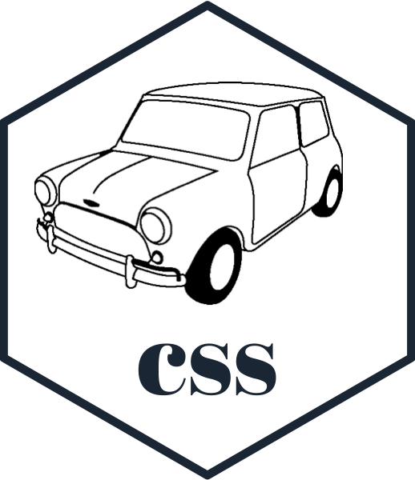

<!-- README.md is generated from README.Rmd. Please edit that file -->

```{r, include = FALSE}
knitr::opts_chunk$set(
  collapse = FALSE,
  comment = "=> ",
  fig.path = "man/figures/README-",
  out.width = "100%"
)

library(glue)
library(minicss)
library(htmltools)
```

```{r echo = FALSE, eval = FALSE}
# Quick logo generation. Borrowed heavily from Nick Tierney's Syn logo process
library(magick)
library(showtext)
font_add_google("Abril Fatface", "gf")


# pkgdown::build_site(override = list(destination = "../coolbutuseless.github.io/package/minicss"))
```


```{r echo = FALSE, eval = FALSE}
img <- image_read("man/figures/mini-cooper-s.gif") %>%
  image_transparent(color = "#f9fafb", fuzz = 10) %>%
  image_trim() %>%
  image_threshold()


hexSticker::sticker(subplot  = img,
                    s_x      = 0.92,
                    s_y      = 1.2,
                    s_width  = 1.5,
                    s_height = 0.95,
                    package  = "css",
                    p_x      = 1,
                    p_y      = 0.5,
                    p_color  = "#223344",
                    p_family = "gf",
                    p_size   = 11,
                    h_size   = 1.2,
                    h_fill   = "#ffffff",
                    h_color  = "#223344",
                    filename = "man/figures/logo.png")

image_read("man/figures/logo.png")
```


# minicss 

<!-- badges: start -->


<!-- badges: end -->

The goal of `minicss` is to be able to programatically create CSS styles and style sheets 
from within R.

`minicss` objects and output are compabile with Shiny (see the [vignette](https://coolbutuseless.github.io/package/minicss/articles/shiny.html))


## Overview

`minicss` is  a collection of R6 objects a user creates and encapsulates within
one other to build CSS style sheets


| Need to build...     | R6 object          | alternate initialisation |
|----------------------|--------------------|--------------------------|
| CSS Properties       |                    | `css_prop`               |
| CSS Selectors        | `Selector$new()`   | `css_sel()`              |
| KeyFrames            | `Keyframe$new()`   | `css_keyframe()`         |
|                      | `Keyframes$new()`  | `css_keyframes()`        |
| CSS Styles           | `Style$new()`      | `css_style()`            |
| CSS Style Sheets     | `StyleSheet$new()` | `css_stylesheet()`       |


### Quick examples


| CSS Entity    | code                                       | result                     |
|---------------|--------------------------------------------|----------------------------|
| Properties    | `css_prop$'font-family'$cursive`           | `font-family: cursive;`    |
|               | `css_prop$'animation-delay'$set(12)`       | `animation-delay: 12;`     |
| Selectors     | `css_sel('#cindy')$child_of('#carol')`     | `#carol > #cindy`          |
| Inline Styles | `css_style(colour='red')$update(margin=0)` | `color: red; margin: 0;`   |
| CSS Styles    | `css_style(".red", colour='red', width='100%')`       | `.red { color: red; width: 100% }`           |
|               | `css_style(".big", css_prop$'font-size'$set('12px'))` | `.big { font-size: 12px; }`                  |
| Style Sheets  | `css_stylesheet(style1, style2)`                      | `.style1 {color:red;}  .style2{color:blue;}` |


## Installation

You can install the development version from [GitHub](https://github.com/coolbutuseless/minicss) with:

``` r
# install.packages("devtools")
devtools::install_github("coolbutuseless/minicss")
```


## Future

The CSS specification is a bit wart-y, 
so there are plenty of weird cases that need to be explicitly handled.  Some of 
these cases are currently handled by `minicss`, and I'll add others as 
they're needed.


## Vignettes


* [CSS Selectors](https://coolbutuseless.github.io/package/minicss/articles/Selectors.html)
* [CSS Property helper `css_prop`](https://coolbutuseless.github.io/package/minicss/articles/Properties.html)
* [Styles](https://coolbutuseless.github.io/package/minicss/articles/Styles.html)
* [StyleSheets](https://coolbutuseless.github.io/package/minicss/articles/StyleSheets.html)
* [Keyframes and Animation](https://coolbutuseless.github.io/package/minicss/articles/animation.html)


### Example: All-in-one example


```{r}
#~~~~~~~~~~~~~~~~~~~~~~~~~~~~~~~~~~~~~~~~~~~~~~~~~~~~~~~~~~~~~~~~~~~~~~~~~~~~~
# Build some selectors
#~~~~~~~~~~~~~~~~~~~~~~~~~~~~~~~~~~~~~~~~~~~~~~~~~~~~~~~~~~~~~~~~~~~~~~~~~~~~~
sel1 <- Selector$new('h1')$class('demo')
sel2 <- css_sel("h2")$class('highlight')

#~~~~~~~~~~~~~~~~~~~~~~~~~~~~~~~~~~~~~~~~~~~~~~~~~~~~~~~~~~~~~~~~~~~~~~~~~~~~~
# Build some keyframes for animating elements
#~~~~~~~~~~~~~~~~~~~~~~~~~~~~~~~~~~~~~~~~~~~~~~~~~~~~~~~~~~~~~~~~~~~~~~~~~~~~~
kf1 <- Keyframe$new('from', color = '#123456')
kf2 <- css_keyframe('to', color = '#1289ae')$translateX(10, 'px')
keyframes  <- Keyframes$new("pulser", kf1, kf2)

#~~~~~~~~~~~~~~~~~~~~~~~~~~~~~~~~~~~~~~~~~~~~~~~~~~~~~~~~~~~~~~~~~~~~~~~~~~~~~
# Build some styles
#~~~~~~~~~~~~~~~~~~~~~~~~~~~~~~~~~~~~~~~~~~~~~~~~~~~~~~~~~~~~~~~~~~~~~~~~~~~~~
style1 <- Style$new(
  sel1, 
  css_prop$animation(name = 'pulser', duration = 0.8, direction = 'alternate')
)
style2 <- Style$new('.mini', background_color = 'green')
style3 <- Style$new(sel2, css_prop$`text-decoration`$underline)

#~~~~~~~~~~~~~~~~~~~~~~~~~~~~~~~~~~~~~~~~~~~~~~~~~~~~~~~~~~~~~~~~~~~~~~~~~~~~~
# Create a style sheet
#~~~~~~~~~~~~~~~~~~~~~~~~~~~~~~~~~~~~~~~~~~~~~~~~~~~~~~~~~~~~~~~~~~~~~~~~~~~~~
stylesheet <- css_stylesheet(style1, style2, style3, keyframes)

#~~~~~~~~~~~~~~~~~~~~~~~~~~~~~~~~~~~~~~~~~~~~~~~~~~~~~~~~~~~~~~~~~~~~~~~~~~~~~
# Change my mind about the background colour of 'style2'
#~~~~~~~~~~~~~~~~~~~~~~~~~~~~~~~~~~~~~~~~~~~~~~~~~~~~~~~~~~~~~~~~~~~~~~~~~~~~~
style2$update(background_colour = '#a0a0ff')

#~~~~~~~~~~~~~~~~~~~~~~~~~~~~~~~~~~~~~~~~~~~~~~~~~~~~~~~~~~~~~~~~~~~~~~~~~~~~~
# Create an inline style
#~~~~~~~~~~~~~~~~~~~~~~~~~~~~~~~~~~~~~~~~~~~~~~~~~~~~~~~~~~~~~~~~~~~~~~~~~~~~~
inline_style <- Style$new(border = "1px solid #123456")$
  update(width = "50%", padding = '10px')$
  as_inline()

#~~~~~~~~~~~~~~~~~~~~~~~~~~~~~~~~~~~~~~~~~~~~~~~~~~~~~~~~~~~~~~~~~~~~~~~~~~~~~
# Insert the stylesheet in an example HTML document
#~~~~~~~~~~~~~~~~~~~~~~~~~~~~~~~~~~~~~~~~~~~~~~~~~~~~~~~~~~~~~~~~~~~~~~~~~~~~~
html <- glue::glue("
<html>
<head>
  <title>Example</title>
  <style>
{stylesheet}
  </style>
</head>
<body>
<div style='{inline_style}'>
<h1 class = 'demo'> Hello #Rstats</h1>
<h2 class='highlight'> A minicss demo! </h2>
This is an example of using <span class='mini'>minicss</span> to manipulate CSS.
</div>
</body>
</html>")
```


```{r echo = FALSE, eval = FALSE}
html
htmltools::browsable(HTML(html))
```


