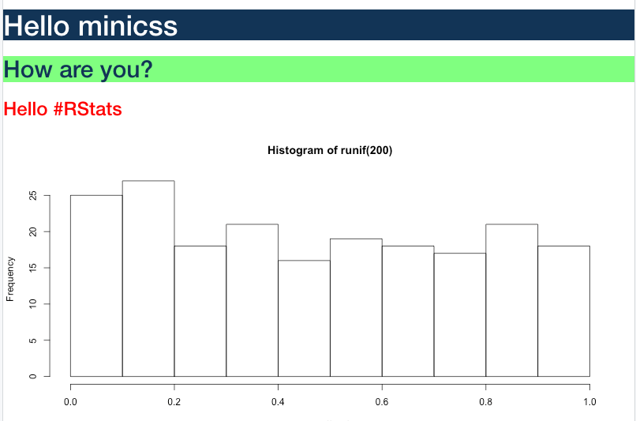

```{r, include = FALSE}
knitr::opts_chunk$set(
  collapse = TRUE,
  comment = "#>"
)
```

```{r setup}
library(minicss)
```


# Using `minicss` with Shiny

Style sheets created with `minicss` can be inserted as a style block in the 
header of a Shiny UI using `shiny::tags$head` and `shiny::tags$style`.

Can also use inline styles using `Style$new()` or `css_style` within the creation of
an individual element.

```{r eval = FALSE}
# File: app.R
library(minicss)

# Create a style sheet
my_styles <- css_stylesheet()
my_styles$add('h1', colour = 'white'  , background_color = '#123456')
my_styles$add('h2', colour = '#123456', background_color = '#80ff80')


ui <- bootstrapPage(
  tags$head(
    tags$style(my_styles) # set the style sheet for the document
  ),
  h1("Hello minicss"),
  h2("How are you?"),
  h3("Hello #RStats", style = css_style(color = 'red')), # inline style
  plotOutput('plot')
)

server <- function(input, output) {
  output$plot <- renderPlot({
    hist(runif(200))
  })
}

shinyApp(ui = ui, server = server)
```


